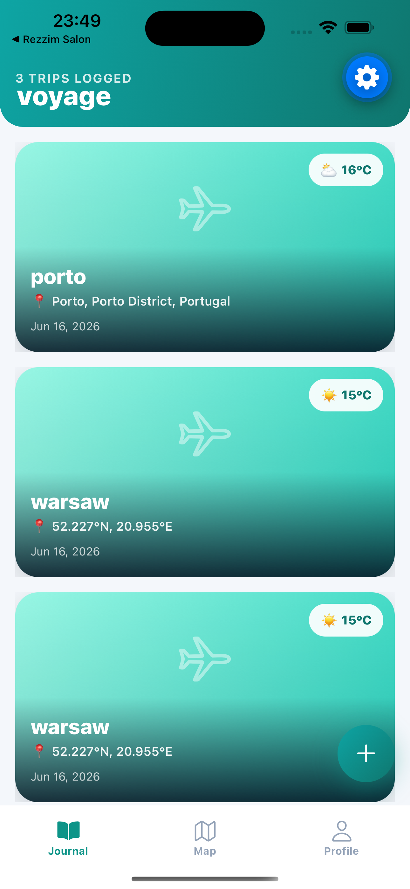
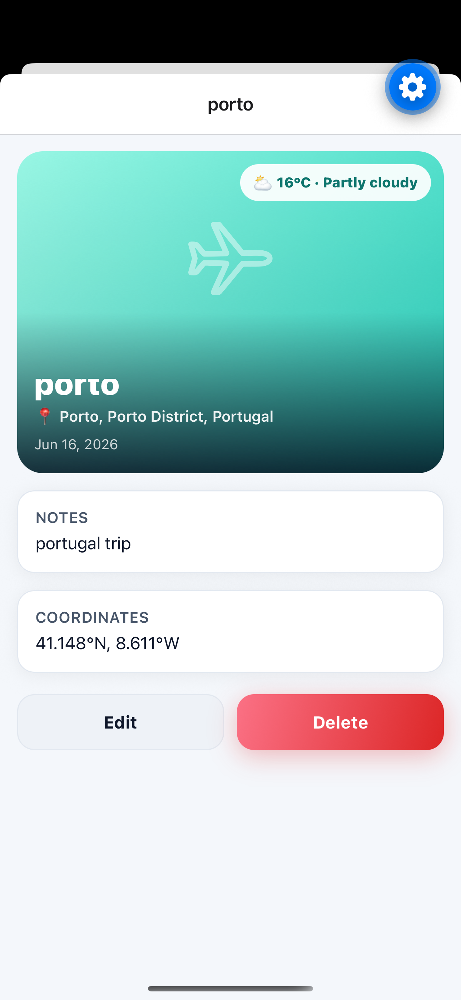
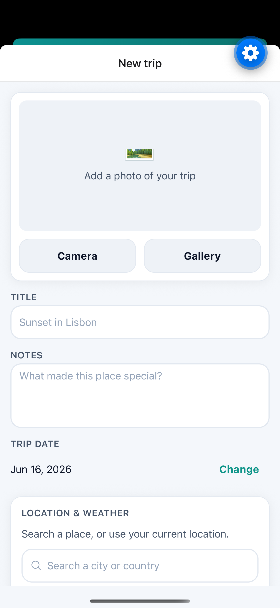
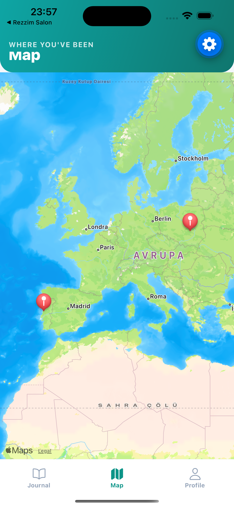
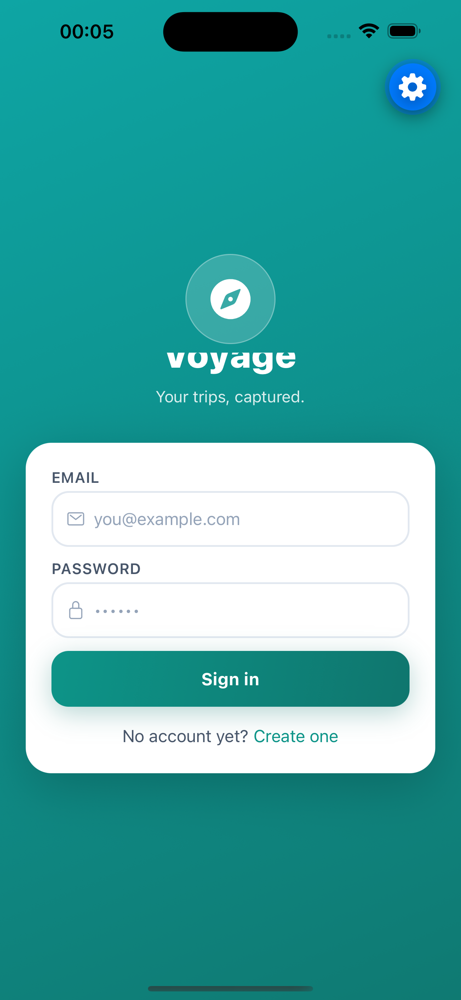
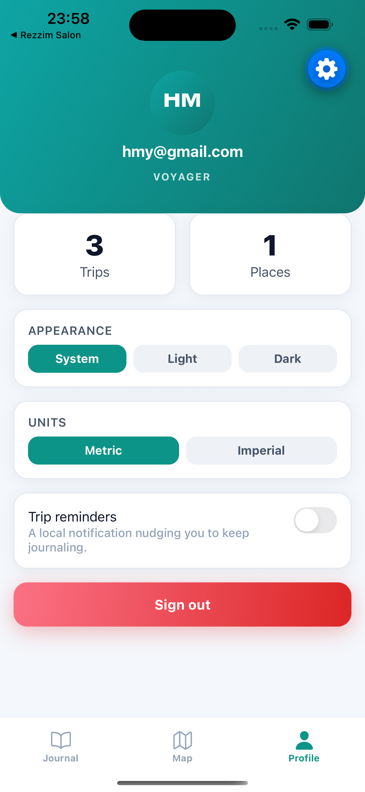

# 🧭 Voyage — Travel Journal

> Capture every trip with a photo, the place it happened, and the weather that day — synced to the cloud and readable offline.

Voyage is a React Native (Expo) travel journal. Sign in, add a trip with a photo from your
camera or gallery, tag it with your GPS location, and the app records the live weather at that
spot. Your trips live in a cloud database (so they survive a reinstall) and stay browsable even
with no connection.

Built for the *Mobile Programming Languages* laboratory project.

---

## 📸 Screenshots

> Captured on the iOS Simulator (Expo Go, SDK 56).

| Journal | Trip detail | Add trip | Map |
| --- | --- | --- | --- |
|  |  |  |  |

| Login | Profile & settings (light/dark) |
| --- | --- |
|  |  |

---

## ✨ Features

- **Email/password accounts** — each user sees only their own trips; auto-login on relaunch.
- **Cloud sync** — trips and photos persist in Supabase (Postgres + Storage); reinstall the app, sign back in, everything is still there.
- **Rich entries** — title, notes, a photo (camera *or* gallery), GPS location with a reverse-geocoded place name, and a captured weather snapshot.
- **Live weather** — fetched from the Open-Meteo API for the trip's coordinates.
- **Map view** — all located trips as pins; tap a callout to open the trip.
- **Offline-first** — trips load from an on-device cache instantly and remain readable with no connection; an offline banner appears automatically.
- **Polished UX** — swipe-to-delete, smooth animations, haptic feedback, pull-to-refresh, light/dark theme, metric/imperial units, and optional local reminder notifications.

---

## 🛠 Tech stack

| Area | Choice |
| --- | --- |
| Framework | **Expo SDK 56** · React Native 0.85 · React 19 · TypeScript |
| Navigation | **Expo Router** (file-based) — Stack + Tabs + Modal |
| State | **Redux Toolkit** + **RTK Query** (weather) |
| Backend | **Supabase** — Auth, Postgres (Row Level Security), Storage |
| External API | **Open-Meteo** (weather, key-less) |
| Native | expo-image-picker, expo-location, expo-notifications, expo-haptics, expo-secure-store |
| Motion & gestures | react-native-reanimated, react-native-gesture-handler |
| Testing | Jest (`jest-expo`) + React Native Testing Library |
| Quality | ESLint (`eslint-config-expo`) + Prettier |

---

## 🧱 Architecture

State is managed with **Redux Toolkit** — the pattern the project brief recommends. The store is
split into focused slices, async work runs through `createAsyncThunk` with explicit
loading/success/error states, and the weather API uses **RTK Query** so caching and request
states are handled for us. Components follow a **presentational / container** split: the screens in
`app/` wire data in, while `components/` stay dumb and reusable (which also makes them easy to test).

```
src/
├── app/                     # Expo Router routes (file = screen)
│   ├── _layout.tsx          # Root: providers + auth gate + root Stack
│   ├── index.tsx            # Splash while the session is restored
│   ├── (auth)/              # login, register            → Stack
│   ├── (tabs)/              # journal, map, profile       → Tabs
│   ├── entry/[id].tsx       # trip detail (dynamic param) → Stack
│   └── modal/               # new, edit/[id]              → Modal
├── components/              # feature components (EntryCard, OfflineBanner…)
│   └── ui/                  # design-system primitives (Button, Card, Text, TextField…)
├── constants/              # theme tokens (theme.ts) + runtime config (config.ts)
├── hooks/                  # useTheme, useNetworkStatus, useHaptics
├── services/               # supabase, entriesService (CRUD), location, imagePicker, notifications, cache
├── store/                  # configureStore, typed hooks, slices/, api/ (RTK Query)
├── theme/                  # ThemeProvider (system / light / dark)
├── types/                  # domain types (Entry, EntryDraft, …)
└── utils/                  # pure, tested helpers (formatDate, validation, weather, geo)
supabase/schema.sql         # tables + Row Level Security + storage policies
```

---

## 🚀 Getting started

### Prerequisites
- Node.js 18+ and npm
- The **Expo Go** app on your phone (or an Android/iOS emulator)
- A free **Supabase** account

### 1. Install
```bash
npm install
```

### 2. Set up Supabase
1. Create a project at [supabase.com](https://supabase.com).
2. Open **SQL Editor → New query**, paste the contents of [`supabase/schema.sql`](supabase/schema.sql), and **Run**. This creates the `entries` table, Row Level Security policies, and the `entry-photos` storage bucket.
3. *(For quick testing)* go to **Authentication → Providers → Email** and turn **off** “Confirm email”, so new accounts can sign in immediately.
4. In **Project Settings → API**, copy the **Project URL** and **anon public** key.

### 3. Configure environment variables
```bash
cp .env.example .env
```
Fill in your values (the anon key is safe on the client — RLS protects the data):
```
EXPO_PUBLIC_SUPABASE_URL=https://your-project.supabase.co
EXPO_PUBLIC_SUPABASE_ANON_KEY=your-anon-key
```

### 4. Run
```bash
npx expo start
```
Scan the QR code with Expo Go, or press `a` / `i` for an emulator.

> **Expo Go note:** authentication, the database, photos, weather, offline cache, haptics, gestures and animations all work in Expo Go. The **map** and **local notifications** are fully reliable in a [development build](https://docs.expo.dev/develop/development-builds/introduction/) / the EAS preview APK; the app degrades gracefully if a map module isn't available.

---

## 📜 Scripts

| Command | Description |
| --- | --- |
| `npm start` | Start the Expo dev server |
| `npm test` | Run the Jest test suite |
| `npm run typecheck` | TypeScript type-check (`tsc --noEmit`) |
| `npm run lint` | ESLint |
| `npm run format` | Format with Prettier |

---

## 🧪 Testing

```bash
npm test
```
49 tests across 9 suites cover the pure business logic (date/validation/weather/geo helpers),
the Redux slices (entries, auth, settings reducers and thunks), and key components
(`EntryCard`, `EmptyState`) using React Native Testing Library.

---

## 📦 Building with EAS

A production-style Android APK (rubric criterion 15):

```bash
npm install -g eas-cli      # or use: npx eas-cli@latest
eas login
eas build --platform android --profile preview
```

The `preview` profile in [`eas.json`](eas.json) produces an installable **.apk**. iOS preview
builds use `eas build --platform ios --profile preview`.

---

## 🔐 Security

- **No secrets in the repo.** Keys come from `.env` (git-ignored); only the public Supabase anon key ships to the client, and **Row Level Security** is what actually protects each user's data.
- **Session tokens in the keychain.** The Supabase session is stored via `expo-secure-store` (Keychain / Keystore), never in plain AsyncStorage.
- **Input validation.** Emails, password length, and entry fields are validated before any request.
- **HTTPS everywhere.** Supabase and Open-Meteo are HTTPS-only.

---

## ✅ How this meets the grading criteria

<details>
<summary><strong>Base criteria 1–15</strong></summary>

| # | Criterion | Where |
| --- | --- | --- |
| 1 | Architecture | Redux Toolkit + presentational/container split (`src/store`, `src/components`) |
| 2 | Responsive layout | Flexbox + relative units throughout; `Screen` wrapper, safe-area aware |
| 3 | Code quality | ESLint + Prettier + strict TypeScript; small, named modules |
| 4 | Tests | 49 tests (`src/**/__tests__`) |
| 5 | Documentation | This README + inline “why” comments + `supabase/schema.sql` |
| 6 | Native features | Camera/gallery, location, notifications, haptics, secure storage (`src/services`) |
| 7 | Async handling | `createAsyncThunk` + RTK Query with loading/error/success states |
| 8 | Navigation | Expo Router: Stack + Tabs + Modal, with route params |
| 9 | Performance | `FlatList` (keyExtractor, tuned render window), `React.memo`, `useCallback` |
| 10 | UI/UX | Central theme, consistent design-system components, press/haptic feedback |
| 11 | State management | Redux Toolkit slices + listener-middleware persistence |
| 12 | Error handling | try/catch + friendly messages, `ErrorBoundary`, NetInfo |
| 13 | Offline mode | Cache-first entries in AsyncStorage + offline banner |
| 14 | Security | SecureStore, `.env`, input validation, RLS, HTTPS |
| 15 | Deployment | `app.json` (custom icon/splash) + `eas.json` preview profile |

</details>

<details>
<summary><strong>Extended criteria A–D</strong></summary>

| | Criterion | Where |
| --- | --- | --- |
| A | Backend & database | Supabase Postgres + Storage; data survives reinstall |
| B | Auth & authorization | Email/password, auto-login, logout, route protection, per-user RLS |
| C | External API | Open-Meteo weather, integral to each trip |
| D | Advanced UX | Swipe-to-delete (gestures) + Reanimated animations + haptics |

</details>

---

## 👩‍💻 Authors

**Voyage** was developed collaboratively by:

- **Hasan Mert Yılmaz**
- **Duygu Toplu**

for the *Mobile Programming Languages* laboratory project.

Both authors contributed to the design, development, testing, and documentation of the application.

---

## 📝 License

MIT — for educational use.
